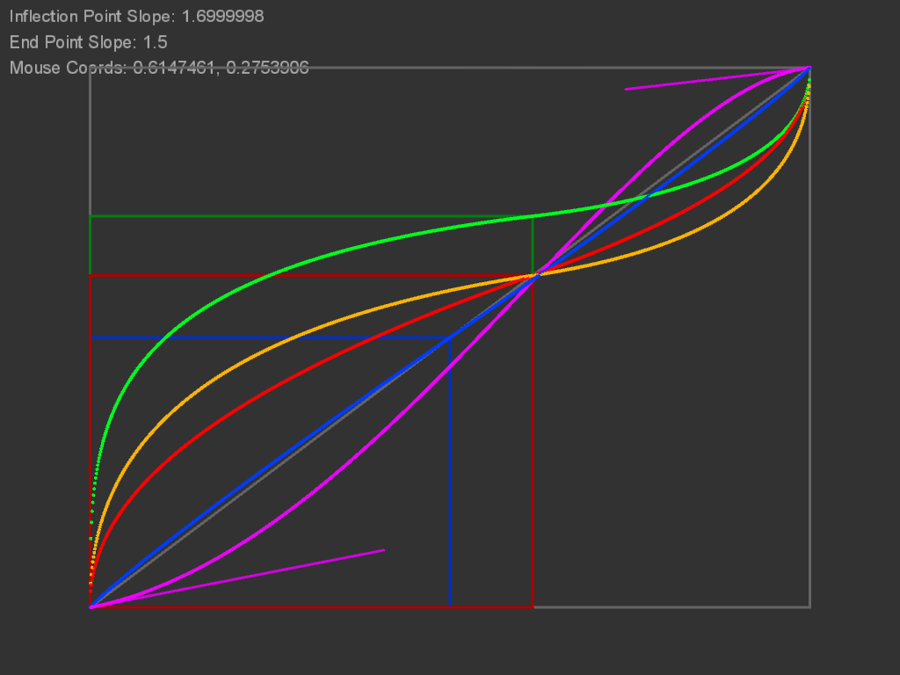

# S-Curves
S-Curves implemented in Processing

<a href="https://youtu.be/0oBYrB-xB6Q" target="_blank">YouTube Video</a>

Based on the S-Curves described in Luminous Landscape forum, here: 

<a href="http://forum.luminous-landscape.com/index.php?topic=52364.0" target="_blank">Luminous Landscape Forum Thread</a>

A user wanted a parametric S-Curve passing through specified coordinates. 

I implemented several versions: 

a) curve passes through point (a,a) (line with slope 1)

b) curve passes through (a,a) with endpoint slope influence

c) curve passes through (a,b) with endpoint slope influence. This is the most responsive curve with the mouse-point intersection requested in the thread.

d) simple curve through (0.5, 0.5) with endpoint slope influence

e) bezier curve with handle positioning proportional to (a,b) ratio

Keyboard Input

left/right — decrease/increase inflection point slope (general strength of effect modifier)

up/down — increase/decrease slope of endpoints

h — show/hide chart features and text of slopes and cursor coordinates

c — show/hide cursor

s — save image

